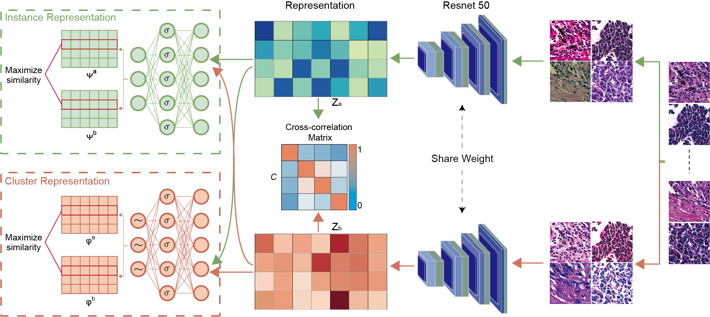

# Histopathology images-based deep learning prediction of prognosis and therapeutic response in small cell lung cancer
## Abstract
Small cell lung cancer (SCLC) is a highly aggressive subtype of lung cancer characterized by rapid tumor growth and early metastasis. Accurate prediction of prognosis and therapeutic response is crucial for optimizing treatment strategies and improving patient outcomes. In this study, we conducted a deep-learning analysis of Hematoxylin and Eosin (H&E) stained histopathological images using contrastive clustering and identified 50 intricate histomorphological phenotype clusters (HPCs) as pathomic features. We identified two of 50 HPCs with significant prognostic value and then integrated them into a pathomics signature (PathoSig) using the Cox regression model. The PathoSig showed significant risk stratification for overall survival and disease-free survival and successfully identified patients who may benefit from postoperative or preoperative chemoradiotherapy. The predictive power of the PathoSig was validated in independent validation cohorts. Furthermore, the PathoSig can provide comprehensive prognostic information beyond the current TNM staging system and molecular subtyping. Overall, our study highlights the significant potential of utilizing histopathology images-based deep learning in improving prognostic predictions and evaluating therapeutic response in SCLC. The PathoSig represents an effective tool that aids clinicians in making informed decisions and selecting personalized treatment strategies for SCLC patients.



## System requirements

#### Hardware Requirements

```
Tesla V100-PCIE-32GB
```

#### OS Requirements

This package is supported for Linux and Windows. The package has been tested on the following systems:

```
Linux 3.10.0-957.el7.x86_64
Windows 11 x64
```
#### Software Prerequisites

```
Python 3.8.12
Numpy 1.20.1
Scipy 1.6.2
Pytorch 1.9.1+/CUDA 10.1
torchvision 0.10.1
Pillow 8.2.0
opencv-python 4.5.5.64
openslide-python 1.1.1
Scikit-learn 0.24.1
R version 4.3.0
```

### Installation guide

It is recommended to install the environment in the Linux 3.10.0-957.el7.x86_64 system.

* First install Anconda3.

* Then install CUDA 10.x and cudnn.

* Finall intall these dependent python software library.

The installation is estimated to take 1 hour, depending on the network environment.


## Predictive models training

#### H&E Tile Segmentation with Watershed


Convert the SVS file to PNG format and use the watershed algorithm to transform the original image into a binary image. Divide the entire H&E image into tiles of size 224x224, ensuring that each tile contains more than 60% of the tissue content.
```
python ./data/H&E Tile Segmentation with watershed.py 
```
#### Extract Features
In the file `./code/1_deeplearning_contrastive_cluster/models/model.py `, we provide an example of how to extract features
from each tile, given their coordinates, using a ResNet50 pre-trained on the ImageNet dataset.
The code to train such a model is available here: https://github.com/topics/resnet50.
```
python ./code/1_deeplearning_contrastive_cluster/train.py 
python ./code/1_deeplearning_contrastive_cluster/test.py 
```
#### Histomorphological Feature

The script constructs a vector where each dimension represents the relative proportion of a cluster within the histopathological image. This vector provides information about the composition and distribution of different histomorphological features within the image.
```
python ./code/1_deeplearning_contrastive_cluster/Histomorphological_Feature.py 
```
#### Model Constrution
The script to train models to predict High-risk/Low-risk at slide-level fashion is available here: `Stratify patient's discovery at TMA level into high and low risk groups for OS.R`.
```
Rscript ./code/2_cox multiple factors analysis _and_prognosis/Stratify patient's discovery at TMA level into high and low risk groups for OS.R 
Rscript ./code/2_cox multiple factors analysis _and_prognosis/Survival analysis of the entire queue.R 

```
where --wsi_path is the path to all the WSI tiff of the patient you are interested.


